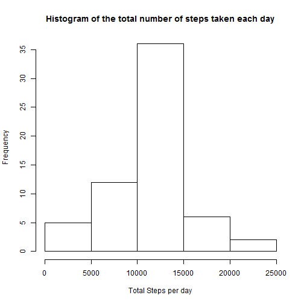
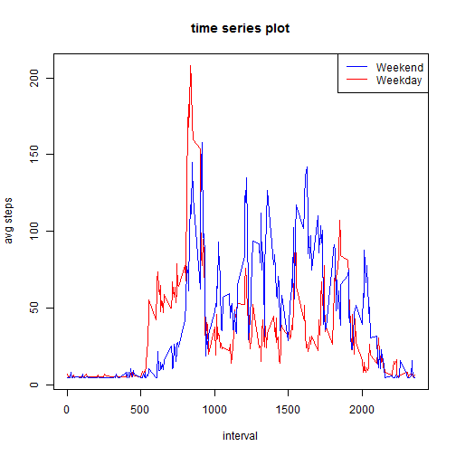

#Code for reading in the dataset and/or processing the data


```r
activity<-read.csv("activity.csv")
summary(activity)
```

```
##      steps                date          interval     
##  Min.   :  0.00   2012-10-01:  288   Min.   :   0.0  
##  1st Qu.:  0.00   2012-10-02:  288   1st Qu.: 588.8  
##  Median :  0.00   2012-10-03:  288   Median :1177.5  
##  Mean   : 37.38   2012-10-04:  288   Mean   :1177.5  
##  3rd Qu.: 12.00   2012-10-05:  288   3rd Qu.:1766.2  
##  Max.   :806.00   2012-10-06:  288   Max.   :2355.0  
##  NA's   :2304     (Other)   :15840
```

#Histogram of the total number of steps taken each day


```r
num_step_per_day <- with(activity, tapply(steps, as.factor(activity$date), sum, na.rm = T))
hist(num_step_per_day,xlab='Total Steps per day',main ='Histogram of the total number of steps taken each day')
```


```r
summary(num_step_per_day)
```

```
##    Min. 1st Qu.  Median    Mean 3rd Qu.    Max. 
##       0    6778   10395    9354   12811   21194
```

```r
mean(num_step_per_day, na.rm = TRUE)
```

```
## [1] 9354.23
```

#What is the average daily activity pattern?

##time series plot

```r
activity_Without_NA <- activity[!is.na(activity$steps),]
avg_steps <- with(activity_Without_NA, tapply(steps, activity_Without_NA$interval, mean))
plot(unique(activity$interval), avg_steps, type = "l", main = "time series plot", xlab = "interval", ylab = "avg steps")
```


##Which 5-minute interval, on average across all the days in the dataset, contains the maximum number of steps

```r
avg_steps[which.max(avg_steps)]
```

```
##      835 
## 206.1698
```


#Imputing missing values

##the total number of missing values


```r
length(activity[is.na(activity$steps),]$steps)
```

```
## [1] 2304
```

## Set the missing values with the mean value & Create New DataSet


```r
activity_fill_na <- activity;
activity_fill_na[is.na(activity_fill_na$steps),]$steps <-mean(avg_steps)
```

##how imputing missing value impact the dataset


```r
num_step_per_day_Fill_Missing_na <- with(activity_fill_na, tapply(steps, as.factor(activity$date), sum, na.rm = T))
hist(num_step_per_day_Fill_Missing_na,xlab='Total Steps per day',main ='Histogram of the total number of steps taken each day')
```



```r
summary(num_step_per_day_Fill_Missing_na)
```

```
##    Min. 1st Qu.  Median    Mean 3rd Qu.    Max. 
##      41    9819   10766   10766   12811   21194
```

```r
summary(num_step_per_day)
```

```
##    Min. 1st Qu.  Median    Mean 3rd Qu.    Max. 
##       0    6778   10395    9354   12811   21194
```

##Weekday


```r
#add new col "isweekend"
activity_fill_na$isweekend<-weekdays(as.Date(activity_fill_na$date)) %in% c('Sunday' ,'Saturday')
activity_fill_na[activity_fill_na$isweekend==T,]$DayType<-"Weekend"
```

```
## Warning in `[<-.data.frame`(`*tmp*`, activity_fill_na$isweekend == T, , :
## provided 5 variables to replace 4 variables
```

```r
activity_fill_na[activity_fill_na$isweekend==F,]$DayType<-"Weekday"
```

```
## Warning in `[<-.data.frame`(`*tmp*`, activity_fill_na$isweekend == F, , :
## provided 5 variables to replace 4 variables
```

```r
activity_weekend<-activity_fill_na[activity_fill_na$isweekend==T,]
activity_weekday<-activity_fill_na[activity_fill_na$isweekend==F,]

avg_steps_weekend <- with(activity_weekend, tapply(steps, activity_weekend$interval, mean))
avg_steps_weekday <- with(activity_weekday, tapply(steps, activity_weekday$interval, mean))

plot(unique(activity_weekday$interval), avg_steps_weekday, type = "l", main = "time series plot", xlab = "interval", ylab = "avg steps" ,col='red')
lines(unique(activity_weekend$interval),avg_steps_weekend,col="blue")

legend("topright",  legend=c('Weekend', 'Weekday'),col=c( 'blue', 'red'), lty=c( 1, 1))
```




